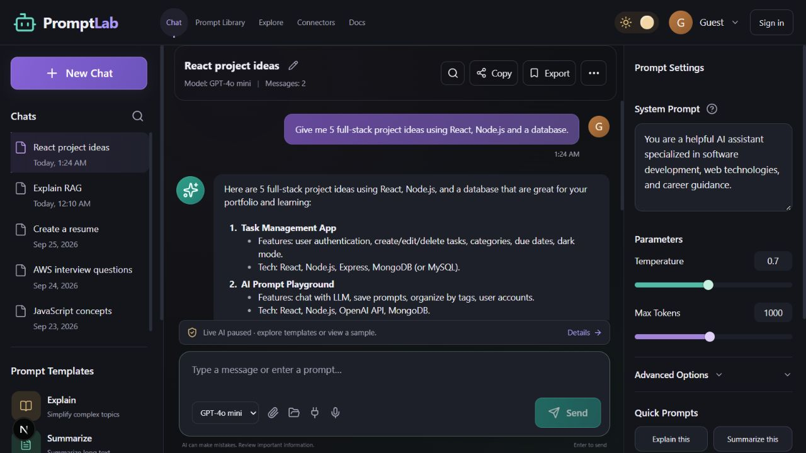

# PromptLab

A responsive AI prompt workspace for organizing conversations, reusing prompts, adjusting model settings, and preparing document-based questions.

Built with **Next.js, React, TypeScript, and Tailwind CSS**, with optional **Supabase authentication**, **OpenAI chat**, and a **Google Drive connector**.

> Live AI is paused by default. The interface, templates, local plugins, and prepared sample conversations can be demonstrated without paid API usage. Sample content is not a live model response.

## Features

### Chat workspace

- Three-column desktop layout with conversation history, central chat, and prompt settings.
- Responsive sidebar and settings drawers, with mobile page navigation.
- New conversations, renaming, title search, and search within message text.
- Basic Markdown rendering, response copying, read-aloud, and text export.
- GPT-4o mini and GPT-4o selection inside the composer.
- System prompt, temperature, output-token limit, top P, and frequency-penalty controls.
- Dark, light, and system appearance with violet, teal, and amber accents.

### Prompts and plugins

- Explain, Summarize, Rewrite, Generate Code, Fix Code, and Career Advice templates.
- Browser-persisted prompt library with save, reuse, and delete actions.
- Local plugins: JSON formatter, text cleanup, and word/character counting.
- Enable or disable individual local plugins. These are built-in tools, not an external plugin marketplace.

### Attachments and voice

- Select local text/code files or import supported files from a folder.
- Preview and remove attachments before sending.
- Up to 10 attachments and 12,000 combined text characters; individual local files must be no larger than 12 KB.
- Folder import skips .env files, .git paths, and node_modules.
- Explicit confirmation naming attached files before their contents go to OpenAI.
- Browser microphone dictation adds text to the draft; it does not send automatically.
- Read-aloud uses a local English system voice when one is available.
- Voice support is dictation plus read-aloud, not a realtime voice-agent service.

### Accounts and integrations

- Supabase email/password sign-up, sign-in, sign-out, and password recovery.
- Optional Google sign-in through Supabase.
- Google Drive OAuth flow, supported document listing, local list search, and document preview/import.
- Server-side OpenAI requests gated by the live-AI flag and verified Supabase access tokens.
- Connection checklist distinguishes credential configuration from live service readiness.

## Tech stack

| Layer | Technology | Purpose |
| --- | --- | --- |
| UI | React, TypeScript | Interactive workspace and typed components |
| Framework | Next.js App Router | Pages, Node.js API routes, and builds |
| Styling | Tailwind CSS and custom CSS | Styling pipeline and reference-based layout |
| Icons | Lucide React | Interface icons |
| Authentication | Supabase Auth | Accounts, sessions, and password recovery |
| AI | OpenAI Chat Completions API | Optional live text responses |
| Documents | Google Identity Services and Drive API | Optional Drive authorization and import |
| Voice | Browser Web Speech APIs | Dictation and local reply playback |
| Current storage | Browser localStorage | Conversations, saved prompts, and preferences |
| Future cloud storage | Supabase Postgres | Schema supplied; synchronization not implemented |

Next.js supplies the backend routes, so there is no separate Express server. LangChain and LangGraph are not used in the current single-request chat flow.

## Quick start

### Requirements

- Node.js **20.9 or newer**, as required by the installed Next.js package.
- npm.
- Chrome is suggested for browser dictation; microphone availability depends on browser and permissions.
- Service credentials are optional for an interface-only demonstration.

### 1. Install dependencies

From the project folder:

    npm ci

### 2. Create your local configuration

In PowerShell:

    Copy-Item .env.example .env.local

Do this only if .env.local does not already exist. Preserve existing credentials when updating the project.

### 3. Start the development server

    npm run dev

Open **http://127.0.0.1:3001**.

### Production build

    npm run build
    npm run start

Both server commands bind to your local computer on port 3001. Stop the development server before starting the production server on the same port.

## Environment variables

Edit .env.local. Never commit that file.

| Variable | Required for | Visibility |
| --- | --- | --- |
| NEXT_PUBLIC_SUPABASE_URL | Supabase authentication | Public project URL |
| NEXT_PUBLIC_SUPABASE_PUBLISHABLE_KEY | Supabase authentication | Public publishable key |
| OPENAI_API_KEY | Live OpenAI responses | Server only |
| AI_CHAT_ENABLED | Live request activation; defaults to false | Server configuration |
| NEXT_PUBLIC_GOOGLE_CLIENT_ID | Google Drive OAuth | Public OAuth client ID |

A legacy NEXT_PUBLIC_SUPABASE_ANON_KEY is also supported instead of the publishable-key variable. Never use a Supabase secret or service-role key in a public variable.

Example configuration, using placeholders:

    NEXT_PUBLIC_SUPABASE_URL=https://YOUR_PROJECT.supabase.co
    NEXT_PUBLIC_SUPABASE_PUBLISHABLE_KEY=YOUR_PUBLIC_KEY
    OPENAI_API_KEY=YOUR_OPENAI_SECRET_KEY
    AI_CHAT_ENABLED=false
    NEXT_PUBLIC_GOOGLE_CLIENT_ID=YOUR_CLIENT_ID.apps.googleusercontent.com

Restart after changing configuration. Public variables are included in the frontend build; rebuild production when they change.

## Configure Supabase authentication

1. Create a Supabase project and obtain its project URL and publishable key.
2. Save both values in .env.local.
3. Open **Authentication → URL Configuration**.
4. Set the **Site URL** to **http://127.0.0.1:3001**.
5. Add these **Redirect URLs** separately:

        http://127.0.0.1:3001
        http://127.0.0.1:3001/**

6. Ensure email/password sign-in is enabled.
7. Restart the app, create a PromptLab account, and confirm its email if required.
8. For optional Google sign-in, configure the Google provider in Supabase separately.

Open local confirmation and recovery links on the same computer running the app. If you use another hostname or port, update the allowed URLs accordingly.

The default Supabase email service has restricted recipients and low sending limits. Use a project team email for initial setup and configure custom SMTP for other users and reliable password recovery. Dashboard accounts, database passwords, and PromptLab user passwords are separate.

## Enable live AI later

1. Save an OpenAI API key in .env.local.
2. Ensure the associated API account has available quota/credits.
3. Change **AI_CHAT_ENABLED=false** to **AI_CHAT_ENABLED=true**.
4. Restart the server and refresh the website.
5. Sign in to PromptLab and send a message.

A configured key does not prove that billing or model access is available. Live AI has not been demonstrated with funded API usage in this project. Keeping the flag false prevents the chat route from calling OpenAI.

## Google Drive connector

See [CONNECTORS.md](CONNECTORS.md) for Google Cloud OAuth setup.

The connector requires Google Drive API access, a web OAuth client ID, and user authorization. It is implemented but is not connected until that setup is completed.

It supports Google Docs exported as text, plain text, Markdown, and CSV. It lists up to 100 recent supported documents; search filters that list. OAuth tokens stay in memory and expire. Refreshing requires reconnecting, and Disconnect revokes access.

## Storage and privacy

- Conversations and saved prompts remain in this browser, with separate storage keys for guest and signed-in accounts.
- This is local persistence, not cloud synchronization or encryption at rest. Clearing browser storage removes that data.
- Supabase validates live-chat sessions; the OpenAI secret key stays on the server.
- Attachments remain local until a live send is explicitly confirmed.
- Chrome dictation may send audio to the browser's recognition service after consent.
- The provided [SQL schema](supabase/schema.sql) is a starting point for future cloud storage. The app does not currently write conversations to it.

## Project structure

    app/
      api/chat/route.ts       Authenticated, gated OpenAI chat endpoint
      api/status/route.ts     Configuration flags without secret values
      globals.css            Themes and responsive layout
      layout.tsx             Root layout and metadata
      page.tsx               Workspace entry point
      icon.svg               App icon
    components/
      PromptLab.tsx          Main workspace and account forms
      DriveConnector.tsx     Google Drive authorization and import
      LocalPlugins.tsx       Local draft tools
      VoiceInput.tsx         Browser dictation
    lib/demo.ts              Types and prepared sample conversations
    supabase/schema.sql      Optional future persistence schema
    docs/                    Architecture and GitHub upload instructions

## Scripts

| Command | Action |
| --- | --- |
| npm run dev | Development server on port 3001 |
| npm run lint | TypeScript checking; not a separate ESLint suite |
| npm run build | Production compilation |
| npm run start | Serve an existing production build |

TypeScript and the production build passed during the latest implementation work. There is no automated test suite. Microphone behavior, external Google authorization, and funded AI responses remain unverified.

## Current limitations

- No cloud history synchronization, public hosting, realtime voice chat, web browsing/search, or URL ingestion.
- PDFs, images, spreadsheets, and arbitrary binary files are not parsed.
- Google Drive OAuth and optional Google sign-in need external configuration.
- Authentication/password recovery depend on Supabase settings and email delivery.
- Basic Markdown rendering does not provide full Markdown syntax or code highlighting.
- Public deployment still needs email delivery setup, service validation, and appropriate usage controls.

## Documentation

- [Demonstration walkthrough](DEMO.md)
- [Google Drive setup and boundaries](CONNECTORS.md)
- [Architecture and data flow](docs/ARCHITECTURE.md)
- [Step-by-step GitHub upload](docs/GITHUB_SETUP.md)

## Suggested GitHub repository description

A responsive AI prompt workspace built with Next.js, React, TypeScript, Supabase Auth, and optional OpenAI and Google Drive integrations.

