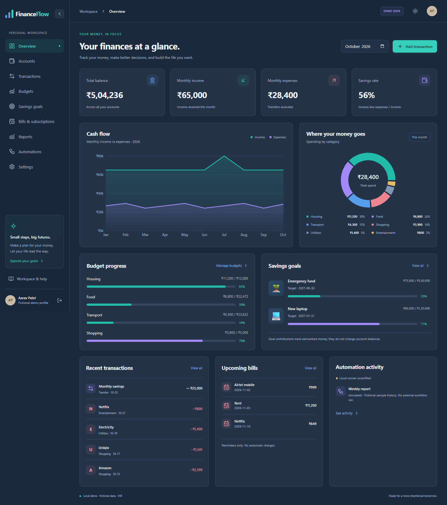
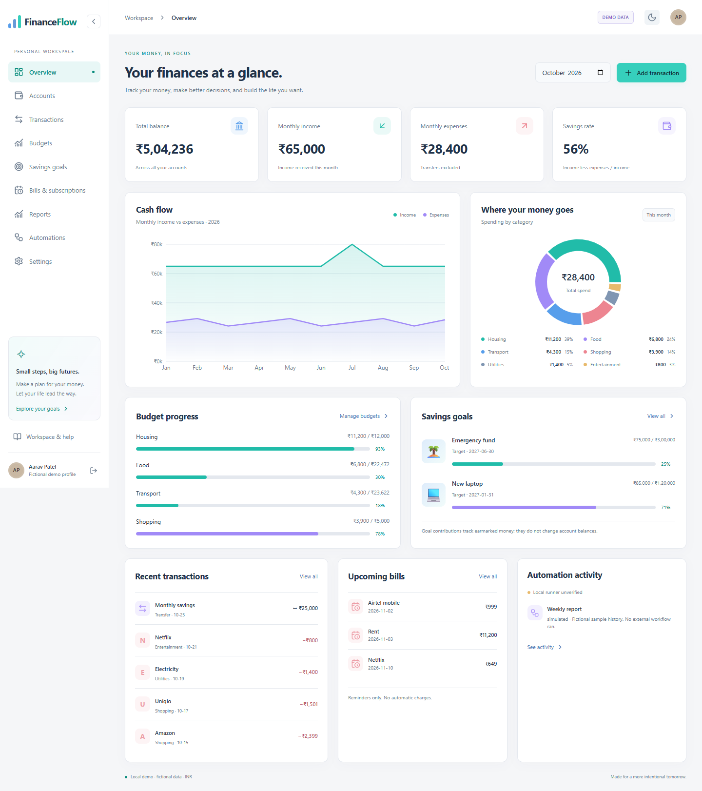
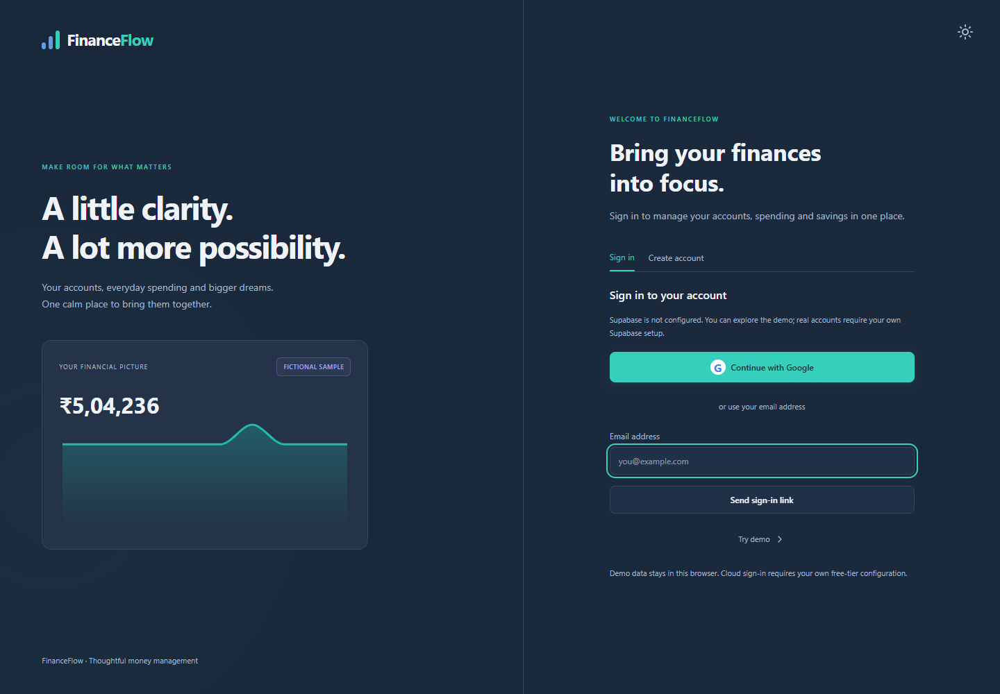
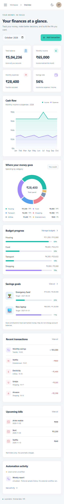
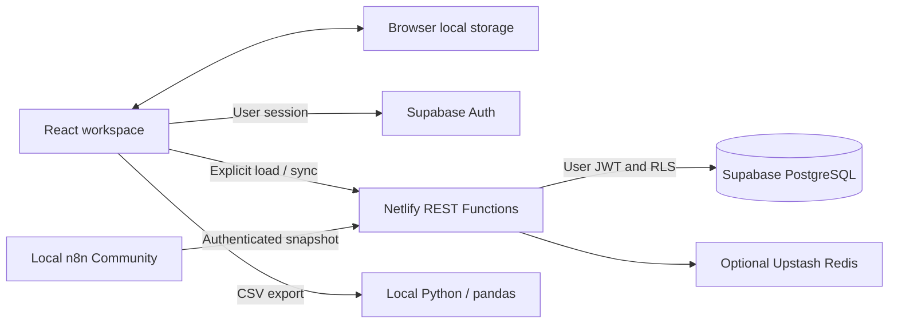

# FinanceFlow

A personal finance portfolio app for understanding everyday spending and planning bigger goals. FinanceFlow combines a responsive React workspace, fictional Indian rupee demo data, optional authenticated REST APIs, and local analytics and automation.

**Status:** the local demo is implemented and browser-verified. Supabase, Google OAuth, Redis, n8n execution and deployment require your configuration and have not been verified against live services. No site is currently deployed. No paid AI or cloud n8n trial is required.



<details>
<summary>Light theme, sign-in page and mobile screenshots</summary>





</details>

Screenshots show the running app with fictional data, not mockups or real financial records.

## Features

| Area | Implemented behavior |
| --- | --- |
| Overview | Account balances, monthly income/expenses/savings rate, cash flow and category charts |
| Accounts | Opening balances and transfers without double-counting income or spending |
| Transactions | Create/edit/delete, search, month/type/category/account filters, CSV export |
| CSV import | Column mapping, account selection, validation preview, existing/within-file deduplication |
| Budgets and goals | Editable budgets, optional unused-allowance rollover, savings targets and contributions |
| Bills and reports | Recurring bills, payment recording, forecasts with assumptions, unusual-spending flags |
| Automations | Local queue, labeled simulations/retries, queue export; separate n8n workflow |
| Authentication | Email sign-in link, registration and Google OAuth when Supabase is configured |
| Workspace | Persistent light/slate-dark themes, explicit sidebar collapse, mobile drawer, accessible account menu, clickable Workspace breadcrumb |
| Settings | Local backup export/reset and explicit cloud load/sync |

Demo access is the secondary **Try demo** link on the sign-in page. AP represents fictional Aarav Patel, not the person using the app. Real sessions show account settings/sign-out; demo offers sign-in, registration and Exit demo.

## Technology

| Layer | Stack |
| --- | --- |
| Frontend | React 19, TypeScript, Vite 7, Tailwind CSS 4, Recharts, Lucide, Papa Parse |
| Tooling | JavaScript/Node.js scripts, npm lockfile, Vitest, Playwright, GitHub Actions |
| REST backend | TypeScript Netlify Functions, bearer authentication, validated workspace mutations |
| Data/auth | Supabase PostgreSQL, email authentication, Google OAuth, per-user row-level security |
| Optional cache | Upstash Redis authenticated rate limiting and user-scoped report caching |
| Local processing | n8n Community workflows; Python and pandas CSV analytics |
| Hosting configuration | Netlify build, function routing, SPA fallback and security headers |

## Architecture



The full demo works without backend credentials. Local storage is not encrypted. Cloud load replaces local state; cloud sync explicitly replaces the user's remote workspace. Signing in does not upload fictional records automatically. The local queue does not dispatch to n8n. See [architecture and access policies](docs/architecture.md).

## Quick start

Use Node **22.12+ within the 22.x line, or Node 24.x**, and npm. Node 24.13 was tested locally. Python and Docker are optional; neither is needed for the demo.

```sh
npm ci
npm run dev
```

Open the printed local URL, normally `http://127.0.0.1:5173`, and select **Try demo**. The initial reporting month is October 2026. All rupee data is fictional and stored in this browser. Theme and sidebar collapse persist; demo entry is session-scoped.

To run the production build locally:

```sh
npm run build
npm run preview
```

The default preview is `http://127.0.0.1:4173`. These are local addresses, not hosted production URLs. Vite does not execute Netlify Functions.

## Commands and verification

| Command | Purpose / prerequisites |
| --- | --- |
| `npm run dev` | Vite development server |
| `npm run typecheck` | Strict TypeScript checks |
| `npm test` | Nine domain/backend-validation/account-menu tests |
| `npm run build` | Type checking and production bundling |
| `npm run preview` | Serve the existing production build |
| `npm run verify:api` | Bundle REST function; test missing-config/auth guards without external requests |
| `npm run verify:browser` | Running dev server at port 5173 and installed Chrome by default |
| `npm run verify:navigation` | Running production preview at port 4173; assumes no Supabase credentials |
| `npm run verify:docs` | Validate local documentation links, asset paths, npm commands, environment coverage and standalone CI paths |

`PREVIEW_URL` overrides either browser script's URL. `BROWSER_CHANNEL=edge` selects an installed Edge browser. Scripts use fresh fictional-data contexts, not your logged-in browser. On PowerShell, to verify the production preview in another terminal:

```powershell
$env:PREVIEW_URL = 'http://127.0.0.1:4173'
npm run verify:browser
npm run verify:navigation
```

Build, nine tests, production browser interaction checks, REST guard checks and the pandas sample have passed locally. The last dependency audit reported zero vulnerabilities; this is a recorded result, not a future guarantee. See [validation and remaining limits](docs/validation.md).

## Environment and optional services

Copy `.env.example` to `.env.local` only if configuring authentication/backend services. Leave credentials absent for a complete demo. Public Vite values are embedded at build time; rebuild after changes.

| Variable | Scope |
| --- | --- |
| `VITE_SUPABASE_URL`, `VITE_SUPABASE_ANON_KEY` | Public browser Supabase URL and anon/publishable key |
| `SUPABASE_URL`, `SUPABASE_ANON_KEY` | Netlify Functions server config; user JWT preserves RLS |
| `UPSTASH_REDIS_REST_URL`, `UPSTASH_REDIS_REST_TOKEN` | Optional backend-only Redis connection |
| `FINANCEFLOW_API_URL`, `FINANCEFLOW_ACCESS_TOKEN` | Local setup placeholders; n8n requires manual URL/Header Auth credential setup and does not consume these automatically |

Never expose a service-role key, Redis token, Google client secret or user access token through a `VITE_` variable or commit it. `.env.example` has empty credential placeholders and is safe to publish.

| Integration | Setup | Current status |
| --- | --- | --- |
| Supabase/Google/email | [Authentication](docs/authentication.md), [schema](supabase/schema.sql) | Implemented boundary; live provider/database tests pending |
| Netlify REST APIs | [API reference](docs/api.md), [deployment](docs/deployment.md) | Local bundle/guard checks passed; credentialed requests pending |
| Redis | Server environment variables | Optional rate/cache code; real connection unverified |
| n8n Community | [Automation guide](docs/automation.md) | Workflow supplied; Docker/runner execution unverified |
| Python/pandas | [Analytics guide](docs/automation.md) | Runnable sample and generated JSON verified |

For full local REST testing, use Netlify CLI (`npx netlify dev`, normally port 8888) with your configuration. Sign in, explicitly load the initially empty cloud workspace in Settings, create an account and transaction, then sync. Back up local data before cloud load. No automatic conflict resolution is implemented.

## Project structure

```text
src/                    UI, auth components, ledger/import/report logic and styles
netlify/functions/      Authenticated TypeScript REST function
supabase/schema.sql     Payload tables, per-user RLS and atomic workspace RPC
analytics/              Python analyzer, fictional sample CSV and sample JSON
automation/             Local Docker Compose and inactive n8n workflow
scripts/                Node browser/API verification and screenshot capture
tests/                  Vitest accounting, import, backend and account-action checks
docs/                   Feature, architecture, API, auth, automation and publishing guides
.github/workflows/      Standalone-repository checks
.env.example            Empty environment placeholders
netlify.toml            Optional deployment configuration
```

## Publishing and deployment

The current Git root is the parent `Development-projects` repository containing sibling apps. **Do not broadly stage that root to publish only FinanceFlow.** A standalone repository is the clearest option. [GitHub publishing guidance](docs/publishing.md) explains copying this curated project outside the parent Git root and choosing standalone versus monorepo CI paths. Nothing has been staged, committed or pushed for you.

Optional deployment is documented in [Netlify setup](docs/deployment.md). No resources were created and no app was deployed. Free service quotas can change; check provider limits and avoid paid upgrades. To guarantee zero cloud spend, use the independent local demo and local Python/n8n. There is no paid AI dependency or cloud n8n trial. Offline computers cannot execute scheduled jobs; resume them manually when online.

## Documentation

- [Feature guide and financial assumptions](docs/features.md)
- [Architecture and authorization](docs/architecture.md)
- [REST API reference](docs/api.md)
- [Authentication and Google provider setup](docs/authentication.md)
- [Local automation and analytics](docs/automation.md)
- [Deployment and free-tier limits](docs/deployment.md)
- [Safe GitHub publishing](docs/publishing.md)
- [Validation and known limitations](docs/validation.md)

No license terms have been selected. Add your chosen license before granting reuse rights.
